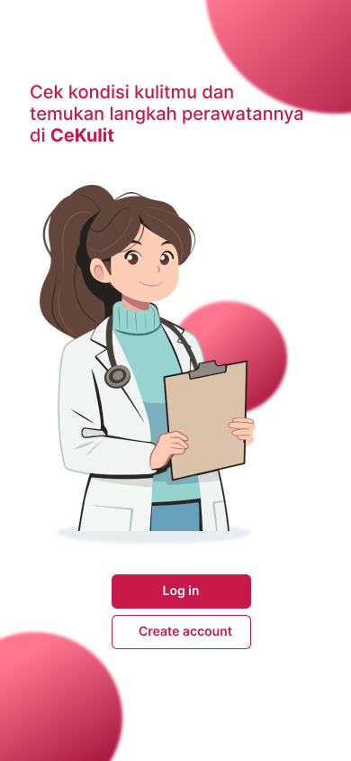
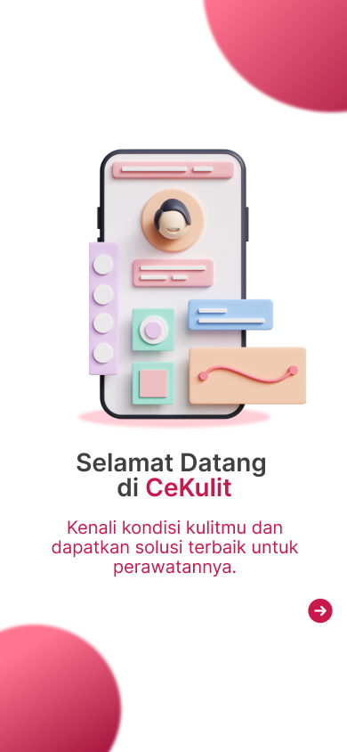
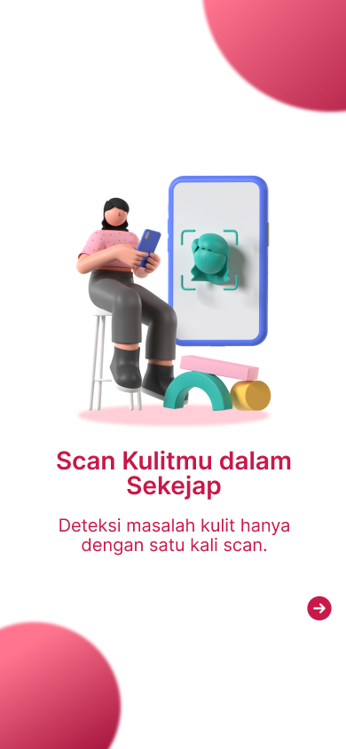
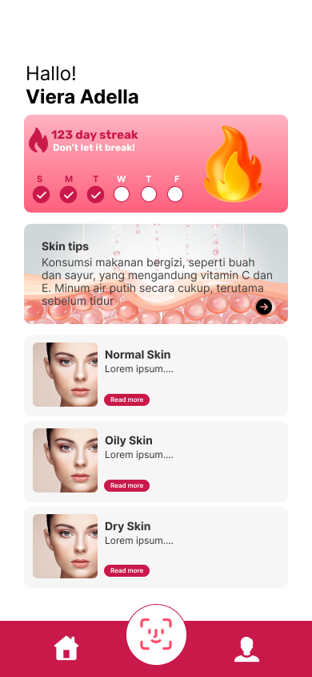
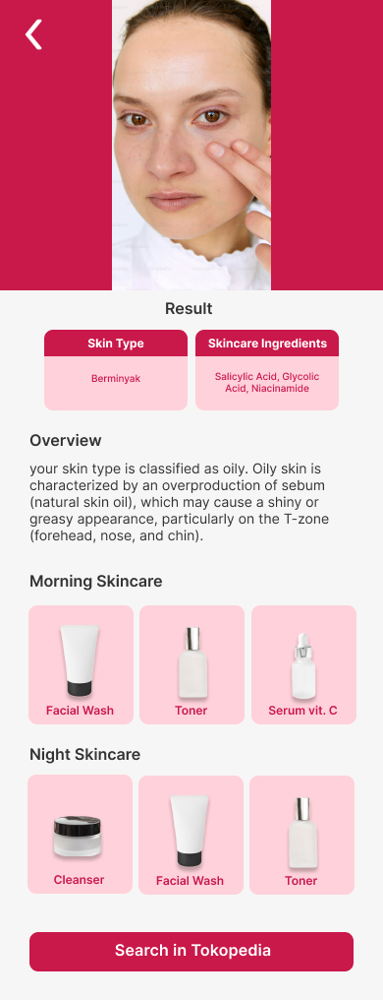
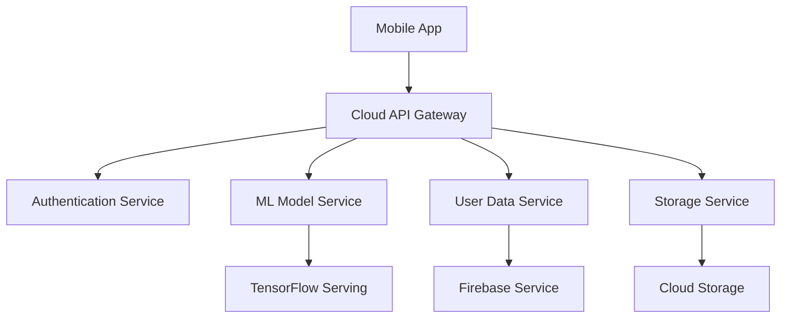

<div align="center">
  
  <h1>CeKulit - Your Personal Skin Type Analysis Assistant</h1>
  <p><i>Empowering everyone to understand and care for their skin better</i></p>
</div>

# C242-PS322 - Bangkit 2024 Batch 2 Capstone Team Project (CeKulit)

Welcome to CeKulit! 👋 We're a dedicated team committed to revolutionizing skin health awareness through innovative technology. Our project combines the power of artificial intelligence, cloud computing, and mobile development to make professional-grade skin analysis accessible to everyone.


## 🌟 Project Overview

CeKulit is an innovative mobile application that leverages advanced AI technology to help users identify their skin type quickly and accurately. By simply taking a photo using their smartphone, users can receive instant analysis of whether their skin is oily or dry, along with personalized skincare recommendations tailored to their specific needs.

## 💡 Why It Matters

According to the World Health Organization (WHO), over 900 million people globally are affected by various skin conditions, with limited access to dermatological care creating a significant barrier to treatment. Many individuals struggle to:
- Identify their basic skin type (oily vs. dry)
- Access professional dermatological advice
- Make informed decisions about skincare products
- Maintain proper skin health routines

CeKulit addresses these challenges by providing:
- Instant skin type analysis
- Personalized skincare recommendations
- Educational resources about skin health
- Accessible technology for everyone

## 👥 Meet Our Team

Our diverse team brings together expertise in machine learning, cloud computing, and mobile development to create an innovative solution for skin health awareness.

| Learning Path | Bangkit ID | Name | University | GitHub | LinkedIn |
|--------------|------------|------|-------------|---------|-----------|
| Machine Learning | M312B4KY2043 | Jasson Franklyn Wang | Universitas Sebelas Maret | [GitHub](https://github.com/4ranklyn) | [LinkedIn](https://www.linkedin.com/in/franklynical) |
| Machine Learning | M312B4KY1317 | Fadhil Yusuf | Universitas Sebelas Maret | [GitHub](https://github.com/huror) | [LinkedIn](https://www.linkedin.com/in/fadhil-yusuf) |
| Machine Learning | M559B4KY2166X | Kemas Muhammad Riski Aditia | Universitas Hang Tuah Pekanbaru | [GitHub](https://github.com/KemasMhd) | [LinkedIn](https://www.linkedin.com/in/kemas-muhammad-riski-aditia-205834251) |
| Cloud Computing | C308B4KY3778 | Reynal Novriadi | Universitas Riau | [GitHub](https://github.com/Reynal121) | [LinkedIn](https://www.linkedin.com/in/reynal-novriadi-686b42334) |
| Cloud Computing | C627B4KY1428 | Fatahillah Alif Pangaribowo | Institut Teknologi Dirgantara Adisutjipto | [GitHub](https://github.com/pangaribowo) | [LinkedIn](https://www.linkedin.com/in/fatahillahalif) |
| Mobile Development | A210B4KY0415 | Alvano Hastagina | Universitas Ibn Khaldun Bogor | [GitHub](https://github.com/alvanochi) | [LinkedIn](https://linkedin.com/in/alvanoh) |
| Mobile Development | A308B4KX441 | Viera Adella | Universitas Riau | [GitHub](https://github.com/vieraadella) | [LinkedIn](https://www.linkedin.com/in/viera-adella-a9b7a72b6/) |

## 🛠️ Technology Stack

### Machine Learning
- TensorFlow 2.x & Keras
- EfficientNetB4 Architecture
- OpenCV
- scikit-learn
- TensorFlow Lite
- Data Augmentation Techniques
- Model Quantization

### Cloud Computing
- Google Cloud Platform
- Firebase (Authentication & Storage)
- Cloud Run
- Cloud Functions
- TensorFlow Serving
- Node.js & Express.js

### Mobile Development
- Kotlin
- CameraX
- Retrofit
- Room Database
- Material Design Components
- Coroutines

## 🚀 Key Features

1. **Instant Skin Analysis**
   - Quick and accurate skin type detection
   - Real-time processing
   - User-friendly interface

2. **Personalized Recommendations**
   - Customized skincare routines
   - Product recommendations
   - Daily skin care tips

3. **Progress Tracking**
   - Historical analysis records
   - Skin condition trends
   - Progress photographs

4. **Educational Resources**
   - Skin health information
   - Best practices
   - Expert tips and guides

## 📱 App Screenshots

<p align="center">
  
  
  
  
  
</p>

## 🔄 Project Architecture



## 🌱 Getting Started

### Prerequisites
- Android Studio Arctic Fox or later
- Android SDK 21 or higher
- Google Cloud Platform account
- Python 3.8+ for ML model training

### Installation
1. Clone the repository
   ```bash
   git clone https://github.com/C242-PS322/CeKulit.git
   ```

2. Set up the development environment
   ```bash
   cd CeKulit
   npm install
   ```

3. Configure your Google Cloud credentials
   [Add specific instructions]

4. Run the application
   [Add specific instructions]

## 📈 Future Development

We're continuously working to improve CeKulit with planned features including:
- Multi-language support
- Advanced skin condition detection
- Integration with healthcare providers
- Community features and user forums
- Enhanced analytics and reporting

## 🤝 Contributing

We welcome contributions from the community! If you'd like to contribute:

1. Fork the repository
2. Create your feature branch (`git checkout -b feature/AmazingFeature`)
3. Commit your changes (`git commit -m 'Add some AmazingFeature'`)
4. Push to the branch (`git push origin feature/AmazingFeature`)
5. Open a Pull Request

## 📜 License

This project is licensed under the MIT License - see the [LICENSE.md](LICENSE.md) file for details.

## 📞 Contact Us

Have questions or suggestions? We'd love to hear from you!

- Email: cekulit.bangkit@gmail.com
- Website: [www.cekulit.com](https://www.cekulit.com)
- Instagram: [@cekulit.id](https://instagram.com/cekulit.id)

## 🙏 Acknowledgments

- [Bangkit Academy](https://grow.google/intl/id_id/bangkit/) for the amazing learning opportunity
- Our mentors and advisors for their invaluable guidance
- The open-source community for their fantastic tools and libraries

---

<div align="center">
  <p>Made with ❤️ by Team CeKulit</p>
  <p>Bangkit Academy 2024 Batch 2 Capstone Project</p>
</div>
